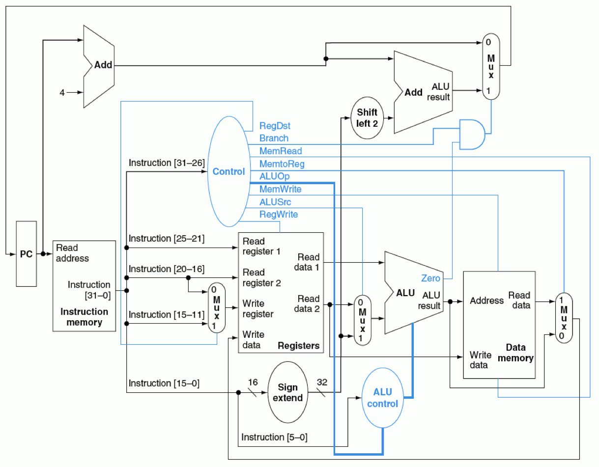
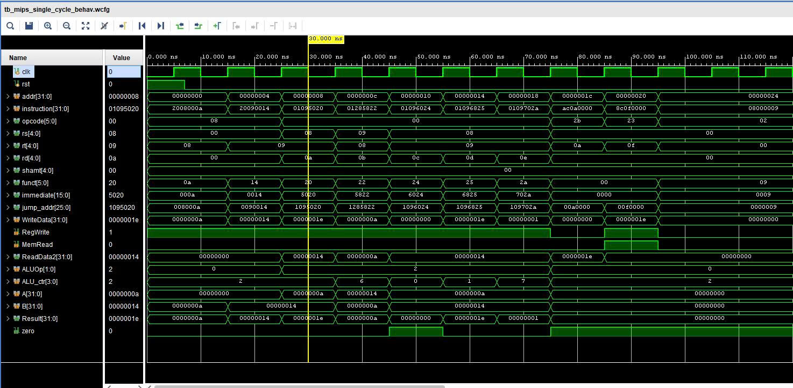
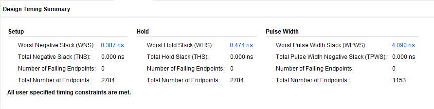
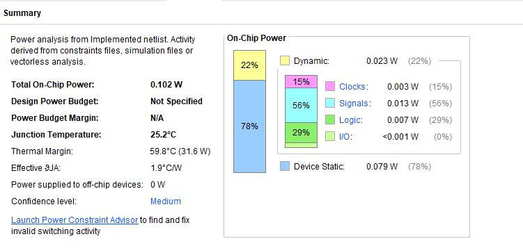

# MIPS32 Single-Cycle CPU

A 32-bit Single-Cycle MIPS processor implemented in Verilog HDL based on the classic MIPS architecture. This project demonstrates the complete datapath and control logic of a single-cycle processor, including instruction fetch, decode, execute, memory access, and write-back.

---

## Features

- 32-bit MIPS Single-Cycle architecture
- Modular RTL design
- Separate Datapath and Control Unit
- Combinational ALU
- 32 × 32-bit Register File
- Instruction Memory
- Data Memory
- Sign Extension Unit
- ALU Control
- Program Counter (PC)
- Multiplexers for datapath selection

---

## Supported Instructions

### R-Type

| Instruction | Description |
|------------|-------------|
| add | Addition |
| sub | Subtraction |
| and | Bitwise AND |
| or | Bitwise OR |
| slt | Set Less Than |

### I-Type

| Instruction | Description |
|------------|-------------|
| addi | Add Immediate |
| lw | Load Word |
| sw | Store Word |
| beq | Branch if Equal |

### J-Type

| Instruction | Description |
|------------|-------------|
| j | Jump |

---

## Processor Datapath

---

## Simulation

The simulation confirms that all implemented instructions execute correctly.

---
## Timing Summary

Fmax = 1 / ( Tclock - WNS ) = 104.0 MHz ( with T = 10ns )

---
## Power

---
## Tools

- Xilinx Vivado Simulator
- Quartus Prime

---

## Future Improvements

- 5-stage Pipeline CPU
- Pipeline Registers
- Forwarding Unit
- Hazard Detection Unit
- Branch Prediction
- Cache Memory

---

